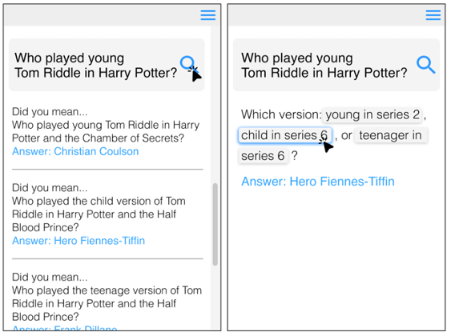
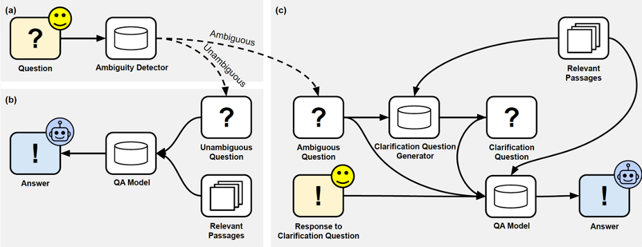

# AskCQ README

This is the repository documenting the paper
[Asking Clarification Questions to Handle Ambiguity in Open-Domain QA](https://arxiv.org/abs/2305.13808) (EMNLP 2023-Findings)
by Dongryeol Lee<sup>* </sup>, Segwang Kim<sup> *</sup>, Minwoo Lee, Joonsuk Park, Sang-Woo Lee, and Kyomin Jung.



* Read the [paper](https://arxiv.org/abs/2305.13808)
* Download the dataset: (https://drive.google.com/drive/folders/1bujroxJ02ym8SgEmC10IsVnCc8HAwTLH?usp=sharing) 

## Content
1. [Citation](#citation)
2. [Dataset Contents](#dataset-contents)
    * [CAmbigNQ format](#cambignq)
    * [Relevant-passages](#relevant-passages)
3. [Baseline codes](#baseline-codes)

## Citation

If you find the our task or CAmbigNQ dataset useful, please cite our paper:
```
@inproceedings{lee2023asking,
  title={Asking Clarification Questions to Handle Ambiguity in Open-Domain QA},
  author={Lee, Dongryeol and Kim, Segwang and Lee, Minwoo and Lee, Hwanhee and Park, Joonsuk and Lee, Sang-Woo and Jung, Kyomin},
  booktitle={Findings of the Association for Computational Linguistics: EMNLP 2023},
  pages={11526--11544},
  year={2023}
}
```

Please also make sure to credit and cite the creators of AmbigNQ and Natural Questions,
the dataset which we built ours off of:
```
@inproceedings{ min2020ambigqa,
    title={ {A}mbig{QA}: Answering Ambiguous Open-domain Questions },
    author={ Min, Sewon and Michael, Julian and Hajishirzi, Hannaneh and Zettlemoyer, Luke },
    booktitle={ EMNLP },
    year={2020}
}

@article{ kwiatkowski2019natural,
  title={ Natural questions: a benchmark for question answering research},
  author={ Kwiatkowski, Tom and Palomaki, Jennimaria and Redfield, Olivia and Collins, Michael and Parikh, Ankur and Alberti, Chris and Epstein, Danielle and Polosukhin, Illia and Devlin, Jacob and Lee, Kenton and others },
  journal={ Transactions of the Association for Computational Linguistics },
  year={ 2019 }
}
```


## Dataset Contents

### CambigNQ

We provide our new dataset CAmbigNQ:

- cq_train.json (23.3M)
- cq_dev.json (3.8M)


`train.json` and `dev.json` files contain a list of dictionary that represents a single datapoint, with the following keys

- `id` (string): an identifier for the question, consistent with the original NQ dataset.
- `question` (string): a question. This is identical to the question in the original NQ except we postprocess the string to start uppercase and end with a question mark.
- `viewed_doc_titles` (a list of strings): a list of titles of Wikipedia pages viewed by crowdworkers during annotations. This is an underestimate, since Wikipedia pages viewed through hyperlinks are not included. Note that this should not be the input to a system. It is fine to use it as extra supervision, but please keep in mind that it is an underestimate.
- `used_queries` (a list of dictionaries): a list of dictionaries containing the search queries and results that were used by crowdworkers during annotations. Each dictionary contains `query` (a string) and `results` (a list of dictionaries containing `title` and `snippet`). Search results are obtained through the Google Search API restricted to Wikipedia (details in the paper). Note that this should not be the input to a system. It is fine to use it as extra supervision.
- `nq_doc_title` (string): an associated Wikipedia page title in the original NQ.
- `dqs` (list of strings): Disambiguated questions for a given question, annotated by AmbigNQ.
- `clarification_answers` (list of lists): Answer set of each corresponding Disambiguated Question. 
- `clarification_question` (string): Our Clarification Questions which clarify the given ambiguous question.

### Relevant-passages

We release top-100 retrieved passages for a given ambiguous question.

- rel_psg_input_ids_bart_train.pkl (106.8M)
- rel_psg_input_ids_bart_dev.pkl (13.3M)

Each file contains a list of encoded relevant passages.

### Predicted answer by SPANSEQGEN

We used BART-based model called SPANSEQGEN to predict answers for ambiguous questions.

- pred_MA_prediction.json (10K)


## Create conda environment and install requirements
```
conda create -n AskCQ && conda activate AskCQ
pip install -r requirements.txt
```


### Clarification Questions Generation
### Training 
| Input in addition to AQ and RPs | CQ   |           | Category |        | Options |        |      |       |
|---------------------------------|------|-----------|----------|--------|---------|--------|------|-------|
|                                 | BLEU-4 | BERTSCORE | EM       | BLEU-1 | Prec.    | Rec. | F1   | Avg. # |
| No Answers for AQ (1)              |  7.9 |      88.9 |     20.2 |   47.3 |    37.4 |   18.2 | 24.5 |   2.0 |
| Predicted Answers for AQ (2)      |  7.9 |      88.9 |     22.8 |   44.0 |    36.9 |   19.0 | 25.1 |   2.0 |
| Ground Truth Answers for AQ (3)    | 15.4 |      89.6 |     25.2 |   46.9 |    34.3 |   34.4 | 34.3 |   3.7 |

You can train CQ generation models using "cli.py" as follows.

```
python cli.py --do_train --task cqg \
    --output_dir ${output_dir} \ # output directory for trained model
    --train_file ${train_file} \ # training data (cq_train.json) 
    --dev_file ${dev_file} \ # dev data (cq_dev.json)
    --MA_type ${MA_type} \ # Multiple Answers added in input. For No Answers for AQ (1)" please set this parameter to "without_answers". For "Predicted Answers for AQ (2)"  and "Ground Truth Answers for AQ (3)" set this parameter to "with_groundtruth_answers". 
    --bert_name "facebook/bart-large" \
    --discard_not_found_answers \
    --train_batch_size ${train_batch_size} \
    --num_train_epochs ${num_train_epochs} \
    --max_token_nums ${max_token_nums} \
    --gradient_accumulation_steps ${gradient_accumulation_steps} \
    --dev_batch_size 8 \
    --eval_period ${eval_period} --wait_step 10 --wiki_2020 --max_question_length ${MAX_QUESTION_LENGTH} \
    --train_passage_dir $train_passage_dir\ # training data relevant passage (rel_psg_input_ids_bart_train.pkl)
    --dev_passage_dir $dev_passage_dir \ # dev data relevant passage (rel_psg_input_ids_bart_dev.pkl)
```
or simply change parameters in "run_cq_training.sh" file and run
```
bash run_cq_training.sh
```

### Inference
You can generate CQ using "cli.py" as follows.
```
python cli.py --do_predict --task cqg \
    --train_file ${train_file} \ training data (cq_train.json) 
    --dev_file ${dev_file} \ dev data (cq_dev.json)
    --output_dir ${output_dir} \
    --dpr_data_dir ${data_dir} \
    --bert_name $bert_name \
    --discard_not_found_answers \
    --train_batch_size ${train_batch_size} \
    --num_train_epochs ${num_train_epochs} \
    --max_token_nums ${max_token_nums} \
    --gradient_accumulation_steps ${gradient_accumulation_steps} \
    --dev_batch_size 8 \
    --eval_period ${eval_period} \
    --wait_step 10 --wiki_2020 --max_question_length ${MAX_QUESTION_LENGTH} \
    --train_passage_dir $train_passage_dir\
    --dev_passage_dir $dev_passage_dir \
    --ambigqa \
    --checkpoint $checkpoint\
    --checkpoint_folder $checkpoint_folder \
    --MA_type $MA_type\ # Multiple Answers added in input. For No Answers for AQ (1)" please set this parameter to "without_answers". For "Predicted Answers for AQ (2)"  set this parameter to "with_predicted_answers". For "Ground Truth Answers for AQ (3)" set this parameter to "with_groundtruth_answers".
    --dq_type pred_cq \ 
    --verbose \
    --jobid ${SLURM_JOB_ID}\
```

For **"Predicted Answers for AQ (2)" case**, provide additional args "--pred_answers_file $pred_answers_file", which is the directory for the multiple answers prediction file (pred_MA_prediction.json).


or simply change parameters in "run_cq_inference.sh" file and run
```
bash run_cq_inference.sh
```

### Clarification-based QA
| CQ used to clarify the AQ                         | NQ pretrained BART |      |      |        | CQ finetuned BART |      |      |        |
|---------------------------------------------------|:------------------:|:----:|:----:|:------:|:-----------------:|:----:|:----:|:------:|
|                                                   |        Pre.        | Rec. |  F1  | # Ans. |        Pre.       | Rec. |  F1  | # Ans. |
|      CQ generated with No Answers for AQ (1)      |               47.9 | 25.2 | 33.0 |    1.5 |              54.4 | 31.1 | 39.6 |    1.6 |
|   CQ generated with Predicted Answers for AQ (2)  |               49.6 | 26.2 | 34.3 |    1.5 |              55.4 | 32.0 | 40.5 |    1.6 |
| CQ generated with Ground Truth Answers for AQ (3) |               39.7 | 37.5 | 38.6 |    2.0 |              47.5 | 49.5 | 48.5 |    2.5 |
| Gold CQ                                           |               47.5 | 39.8 | 43.3 |    2.0 |              58.0 | 53.8 | 55.8 |    2.5 |

You can train Clarification-based QA models as follows. 
```
python cli.py --do_train --task cqa \
    --train_file ${train_file} \  # training data (cq_train.json) 
    --dev_file ${dev_file} \ # dev data (cq_dev.json)
    --output_dir ${output_dir} \  # output directory for trained model
    --bert_name $bert_name \
    --discard_not_found_answers \
    --train_batch_size ${train_batch_size} \
    --num_train_epochs ${num_train_epochs} \
    --max_token_nums ${max_token_nums} \
    --gradient_accumulation_steps ${gradient_accumulation_steps} \
    --dev_batch_size 8 \
    --eval_period ${eval_period} \
    --wait_step 10 --wiki_2020 --max_question_length ${MAX_QUESTION_LENGTH} \
    --train_passage_dir $train_passage_dir\ # training data relevant passage (rel_psg_input_ids_bart_train.pkl)
    --dev_passage_dir $dev_passage_dir \ # dev data relevant passage (rel_psg_input_ids_bart_dev.pkl)
    --verbose \
    --dq_type $dq_type \ # This parameter decides the type of question used for the QA model. Set this parameter to "gold_cq" for training.
    --checkpoint ${checkpoint} # We utilized BART-large or NQ pretrained BART-large for checkpoint
```
or simply change parameters in "run_cambigqa_train.sh" file and run
```
bash run_cambigqa_train.sh
```

You can predict answers by Clarification-based QA models.
```
python cli.py --do_predict --task cqa \
    --train_file ${train_file} \ # training data (cq_train.json) 
    --dev_file ${dev_file} \ # dev data (cq_dev.json)
    --output_dir ${output_dir} \ # output directory for predictions
    --dpr_data_dir ${data_dir} \
    --bert_name $bert_name \
    --discard_not_found_answers \
    --train_batch_size ${train_batch_size} \
    --num_train_epochs ${num_train_epochs} \
    --max_token_nums ${max_token_nums} \
    --gradient_accumulation_steps ${gradient_accumulation_steps} \
    --dev_batch_size 8 \
    --eval_period ${eval_period} \
    --wait_step 10 --wiki_2020 --max_question_length ${MAX_QUESTION_LENGTH} \
    --train_passage_dir $train_passage_dir\
    --dev_passage_dir $dev_passage_dir \
    --ambigqa \
    --checkpoint $checkpoint\
    --checkpoint_folder $checkpoint_folder \ # trained Clarification-based QA model directory
    --MA_type $MA_type\ 
    --dq_type $dq_type \
    --verbose \
    --jobid ${SLURM_JOB_ID}\
```
**(1) For "CQ generated with No Answers for AQ (1)" case**, input "--dq_type pred_cq" and "--MA_type without_answers". 

**(2) For "CQ generated with Predicted Answers for AQ (2)" case**, input "--dq_type pred_cq" and "--MA_type with_predicted_answers".

**(3) For "CQ generated with Gold Answers for AQ (3)" case**, input "--dq_type pred_cq" and "--MA_type with_groundtruth_answers".

**(4) For "Gold CQ (4)" case**, input input "--dq_type gold_cq" and "--MA_type with_groundtruth_answers".

**For (1), (2), and (3)**, please provide additional args "--pred_cq_file" which is the directory of the generated CQ file from the CQ generation task.

or simply change parameters in "run_cambigqa_inference.sh" file and run
```
bash run_cambigqa_inference.sh
```


